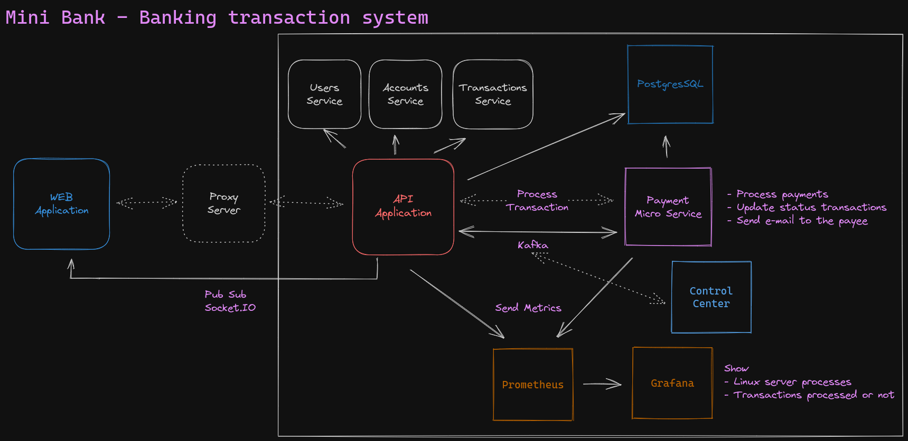

# Mini Bank

> Introductory project to microservices and queue management with Kafka.

## Structure

<h3 align="left">
  <br>
</h3>

## :zap: Technologies

- [NestJS](https://nestjs.com/)
- [Kafka](https://kafka.apache.org/)
- [PostgreSQL](https://www.postgresql.org/)
- [Typescript](https://www.typescriptlang.org/)
- [NextJS](https://nextjs.org/)

## Pending features

- [x] MonoRepo with Yarn workspace
- [x] Create micro services to payment
- [x] Add typescript
- [x] Create configuration process env
- [x] Send emails to the payee of the transaction
- [ ] Create frontend
- [ ] Create microservices to send emails
- [ ] Tests on projects

## :rocket: Development

```console
❯ sudo docker-compose up -d
```

### Commands backend

```console
❯ yarn server
```

Open app application in bash in src folder project

```console
❯ sudo docker-compose exec app sh
❯ nest g resource resource-name
❯ nest g service service-name
```

### Commands frontend

```console
❯ yarn dev
```

### Documentation API

[URL](http://localhost:3000/api/)

### Commands kafka console

Producer

```console
❯ sudo docker-compose exec kafka bash
❯ kafka-console-producer --topic topic-name --bootstrap-server localhost:9092
```

Consumer

```console
❯ sudo docker-compose exec kafka bash
❯ kafka-console-consumer --topic topic-name --bootstrap-server localhost:9092
```

### Environments

- Create `.env` and set on api services;

---

<h4 align="center">
  Code made :purple_heart: by <a href="https://www.linkedin.com/in/jonathanccardoso/" target="_blank">Jonathan Cardoso</a>
</h4>
